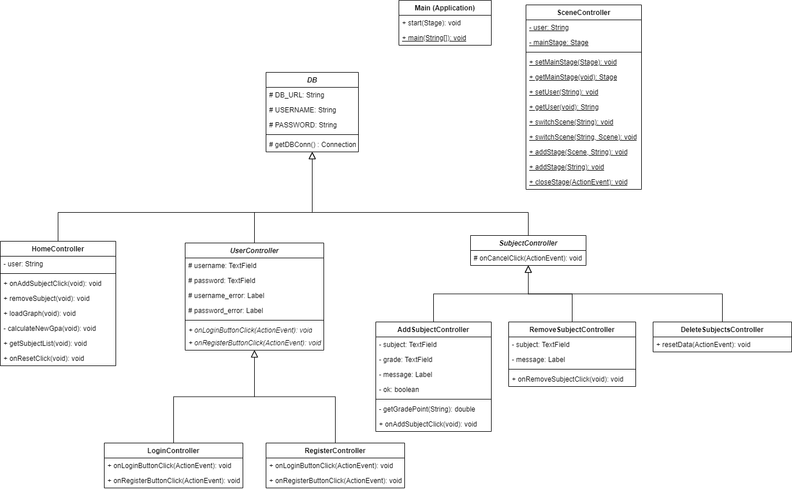
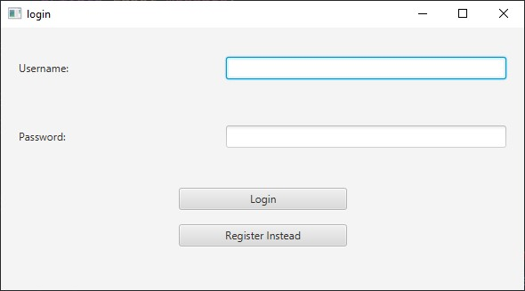
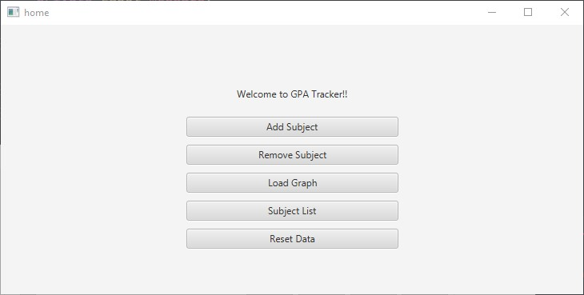
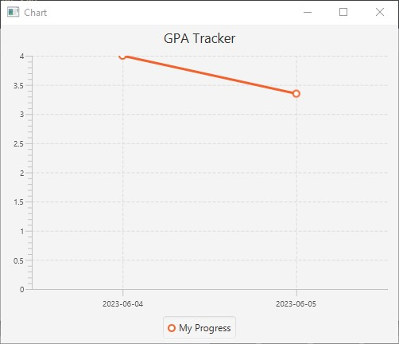
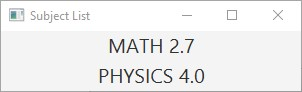
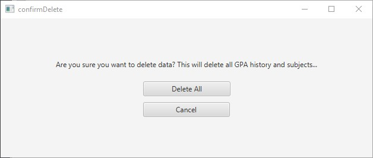

# GPA-Tracker

<h3>Working with Javafx and JDBC to create a GPA tracker</h3>

This utilizes JDBC to store subjects and grades belonging to the user.
Users can recalculate their GPA whenever there is a change to their subjects, minimizing storage cost.

The UML Diagram

Screenshots of program:

